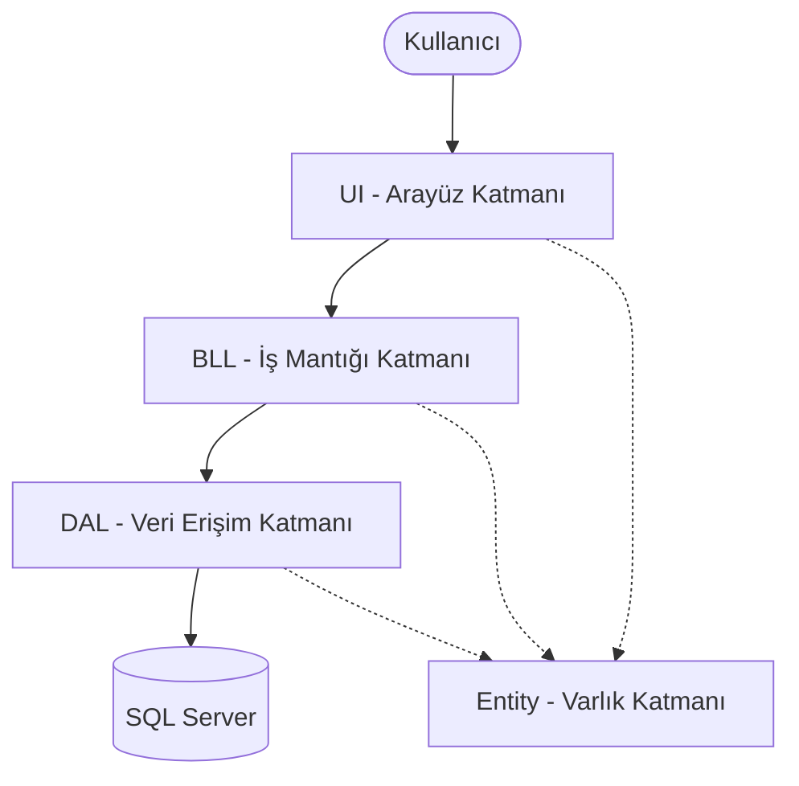

# İnsan Kaynakları Personel Takip Sistemi

Bu proje, katmanlı mimari yapısı kullanılarak geliştirilmiş kapsamlı bir İnsan Kaynakları ve Personel Takip Otomasyonudur. C# programlama dili ve SQL veritabanı kullanılarak tasarlanmıştır.

## 📺 Proje Tanıtım Videosu

Projenin detaylı anlatımı ve kullanım videosu için aşağıdaki linke tıklayabilirsiniz:
👉 **[YouTube: Proje Açıklama Videosu](https://youtu.be/bCzJp7Adcr8)**

## 🏗 Proje Mimarisi

Proje, **N-Tier (Çok Katmanlı) Mimari** prensiplerine uygun olarak 4 ana katmandan oluşmaktadır:

*   **ENTITY (Varlık Katmanı):** Veritabanı tablolarının nesne tabanlı karşılıklarını (Personel, Departman, Maaş, vb.) içerir.
*   **DAL (Veri Erişim Katmanı):** Veritabanı bağlantısı ve CRUD (Ekleme, Silme, Güncelleme, Listeleme) işlemlerini gerçekleştiren katmandır.
*   **BLL (İş Mantığı Katmanı):** Veri işleme kuralları, doğrulamalar ve hesaplama mantıklarının bulunduğu katmandır.
*   **UI (Kullanıcı Arayüzü):** Kullanıcının sistemle etkileşime girdiği Windows Form ekranlarıdır.

## 🚀 Özellikler ve Modüller

Proje aşağıdaki temel modülleri içermektedir:

1.  **Personel Yönetimi:** Personel ekleme, düzenleme, silme ve detaylı listeleme.
2.  **Departman Yönetimi:** Departman tanımlama ve düzenleme işlemleri.
3.  **Maaş Hesaplama:** Personel maaşlarının hesaplanması, takibi ve yönetimi.
4.  **İzin İşlemleri:** Personel izin talepleri, onay/ret süreçleri ve durum takibi.
5.  **Performans Yönetimi:** Personel performans değerlendirmeleri ve skor takibi.
6.  **Raporlama:** Departman bazlı, personel bazlı ve genel durum raporlarının görüntülenmesi.
7.  **Kullanıcı Yetkilendirme:** Admin ve Standart Kullanıcı rolleri ile güvenli giriş sistemi.

## 🛠 Kullanılan Teknolojiler

*   **Dil:** C# .NET
*   **Arayüz:** Windows Forms (WinForms)
*   **Veritabanı:** SQL Server
*   **Tasarım Deseni:** Layered Architecture (Katmanlı Mimari)

## 📌 Kurulum

Projeyi çalıştırmak için:
1.  Veritabanı yedeğini SQL Server'a yükleyin veya script dosyasını çalıştırın.
2.  `DAL` katmanındaki bağlantı dizesini (Connection String) kendi sunucunuza göre güncelleyin.
3.  Projeyi Visual Studio ile açarak derleyin ve çalıştırın.

---
*Geliştirici: [Adınız Soyadınız]*
