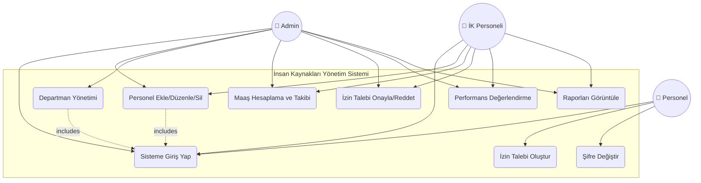

# İnsan Kaynakları Yönetim Sistemi - Use Case Diyagramı

Aşağıdaki diyagram, sistemdeki aktörlerin (Admin ve Personel) gerçekleştirebileceği işlemleri göstermektedir.

```mermaid
graph TD
    %% Actors
    Admin((👤 Admin))
    IK((👤 İK Personeli))
    Personel((👤 Personel))

    %% System Boundary
    subgraph System ["İnsan Kaynakları Yönetim Sistemi"]
        direction TB
        UC1(Sisteme Giriş Yap)
        UC2(Personel Ekle/Düzenle/Sil)
        UC3(Departman Yönetimi)
        UC4(Maaş Hesaplama ve Takibi)
        UC5(İzin Talebi Oluştur)
        UC6(İzin Talebi Onayla/Reddet)
        UC7(Performans Değerlendirme)
        UC8(Raporları Görüntüle)
        UC9(Şifre Değiştir)
    end

    %% Relationships
    Admin --> UC1
    IK --> UC1
    Personel --> UC1
    
    %% Admin Privileges (System Level)
    Admin --> UC2
    Admin --> UC3
    Admin --> UC4
    Admin --> UC6
    Admin --> UC7
    Admin --> UC8
    
    %% IK Personeli Privileges (HR Operations)
    IK --> UC2
    IK --> UC4
    IK --> UC6
    IK --> UC7
    IK --> UC8
    
    Personel --> UC5
    Personel --> UC9
    
    %% Includes (represented as dotted lines with labels)
    UC2 -. includes .-> UC1
    UC3 -. includes .-> UC1
```
