# Proje Mimarisi (Application Architecture)

Bu diyagram Elifproje Personel Takip Sisteminin katmanlı mimarisini göstermektedir.

```mermaid
classDiagram
    %% UI Layer (Kullanıcı Arayüzü)
    namespace UI {
        class GirisFormu
        class AnaMenuForm
        class PersonelYonetimFormu
        class DepartmanYonetimFormu
        class MaasHesaplamaFormu
        class IzinFormu
        class PerformansFormu
        class RaporFormu
        class ThemeHelper
    }

    %% BLL Layer (İş Mantığı Katmanı)
    namespace BLL {
        class PersonelYoneticisi
        class DepartmanYoneticisi
        class MaasYoneticisi
        class IzinYoneticisi
        class PerformansYoneticisi
        class RaporlamaYoneticisi
        class OturumYoneticisi
    }

    %% DAL Layer (Veri Erişim Katmanı)
    namespace DAL {
        class baglantiGetir["dbBaglanti"]
        class PersonelDeposu
        class DepartmanDeposu
        class MaasDeposu
        class IzinDeposu
        class PerformansDeposu
    }

    %% Entity Layer (Varlık Katmanı)
    namespace ENTITY {
        class BaseEntity
        class Personel
        class Departman
        class Maas
        class Izin
        class Performans
        class Roller
    }

    %% İlişkiler - UI -> BLL / DAL
    GirisFormu ..> PersonelDeposu : kullanır (Direkt giriş kontrolü)
    GirisFormu ..> OturumYoneticisi : kullanır
    AnaMenuForm ..> Personel : kullanır
    
    PersonelYonetimFormu ..> PersonelYoneticisi : kullanır
    PersonelYonetimFormu ..> DepartmanYoneticisi : kullanır
    PersonelYonetimFormu ..> MaasYoneticisi : kullanır (Otomatik Maaş)
    
    DepartmanYonetimFormu ..> DepartmanYoneticisi : kullanır
    
    MaasHesaplamaFormu ..> MaasYoneticisi : kullanır
    MaasHesaplamaFormu ..> PersonelYoneticisi : kullanır
    
    IzinFormu ..> IzinDeposu : kullanır (Direkt DAL erişimi)
    
    PerformansFormu ..> PersonelYoneticisi : kullanır
    PerformansFormu ..> PerformansDeposu : kullanır (Direkt DAL erişimi)
    
    RaporFormu ..> PersonelDeposu : kullanır
    RaporFormu ..> DepartmanDeposu : kullanır
    RaporFormu ..> IzinDeposu : kullanır
    RaporFormu ..> PerformansDeposu : kullanır

    %% İlişkiler - BLL -> DAL
    PersonelYoneticisi ..> PersonelDeposu : çağırır
    DepartmanYoneticisi ..> DepartmanDeposu : çağırır
    MaasYoneticisi ..> MaasDeposu : çağırır
    IzinYoneticisi ..> IzinDeposu : çağırır
    PerformansYoneticisi ..> PerformansDeposu : çağırır
    RaporlamaYoneticisi ..> PersonelDeposu : çağırır
    
    %% İlişkiler - DAL -> Veritabanı Yardımcısı
    PersonelDeposu ..> baglantiGetir : kullanır
    DepartmanDeposu ..> baglantiGetir : kullanır
    MaasDeposu ..> baglantiGetir : kullanır
    IzinDeposu ..> baglantiGetir : kullanır
    PerformansDeposu ..> baglantiGetir : kullanır
    
    %% İlişkiler - Entities
    Personel --|> BaseEntity
    Departman --|> BaseEntity
    Maas --|> BaseEntity
    Izin --|> BaseEntity
    Performans --|> BaseEntity
    
    Personel ..> Roller : sahiptir
    Personel ..> Departman : aittir
    Maas ..> Personel : aittir
    Izin ..> Personel : aittir
    Performans ..> Personel : aittir
```

## Katman Açıklamaları
- **UI (Arayüz)**: Kullanıcının etkileşime girdiği formlar.
- **BLL (İş Mantığı)**: Kuralların ve doğrulamaların yapıldığı yönetici sınıfları.
- **DAL (Veri Erişim)**: Veritabanı sorgularının (SQL) çalıştırıldığı depo sınıfları.
- **ENTITY (Varlık)**: Veritabanı tablolarının kod karşılığı olan sınıflar.
